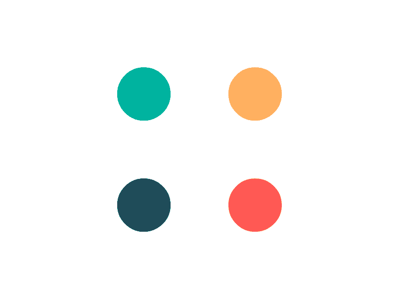
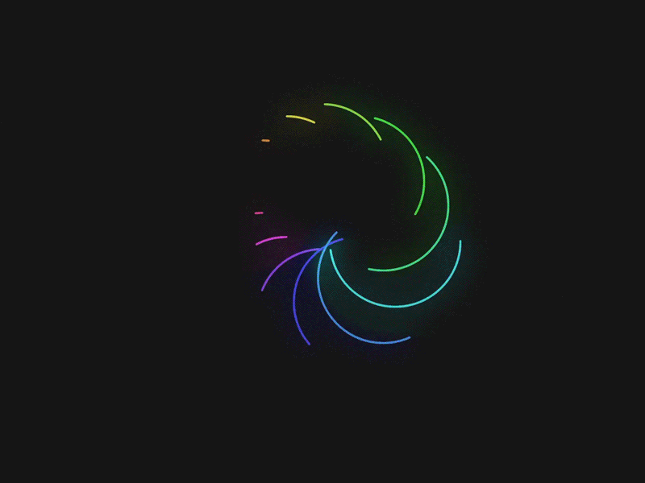

# Animation

In dieser Übung finden Sie verschiedene Wege zum Ziel:

* Animation in D3.JS (siehe auch letzte Woche)
* Animation in CSS (ganz ohne JavaScript!)
* Animation in P5.JS (mit Tweety oder GSAP)
* Animation mit Lottie (z.B. aus AfterEffects, Synfig oder fertigen Animationen)

## Einführung

Animation können Sie inzwischen auf sehr vielen Wegen erreichen. Hier sehen Sie viele verschiedene Wege. In `Beispiele/Beispiel-1-Direktvergleich` sehen Sie fünf verschiedene Wege - längst nicht das Ende der Fahnenstange.

Sie bilden aber drei wichtige Kategorien ab:

- CSS-Animationen (in der Regel deklarativ)
- JavaScript Animationen (in der Regel imperativ)
- Extern erstellte Animationen z.B. in Synfig/Lottie, diese werden oftmals nur linear abgespielt

Prinzipiell ist Ihnen die Wahl der Werkzeuge freigestellt, daher habe ich hier sehr sehr viele Beispiele beigepackt, die alle diese Fälle illustrieren.

## Aufgabe 1: Aufwärmen

In `Aufgabe-1-Aufwaermen` finden Sie ein Grundgerüst. Bitte animieren Sie die fünf Quadrate in irgendeiner Art. Versuchen Sie, den Quadraten ein bestimmtes "Gefühl" zu geben. Hier sind einige Adjektive, die Sie ausprobieren könnten:

- flink
- schleppend
- schwer
- holprig
- spielerisch
- vorsichtig
- tapsig
- elegant
- kaputt
- schmierig
- schwer
- leicht
- sanft

Alternativ funktionieren lautmalerische Ausdrücke total gut:

- wobbel
- boing
- schwibbb
- swoooosh
- **KLaCk!**
- ratatatatatata
- doing

### Vorbereiten

Setzen Sie sich immer vorher ein Ziel. Versuchen Sie, eine ganz bestimmte Art von Animation zu "treffen". Diese Aufgabe können Sie mit Tweety oder GSAP erledigen, beides ist im Grundgerüst bereits enthalten. Bitte beachten Sie, dass GSAP etwas mächtiger ist, es kann zum Beispiel auch zwischen zwei Farben interpolieren und kennt das Konzept von "timelines".

Sehen Sie sich die Beispiele, die GSAP oder Tweety im Namen haben an, vielleicht ist hier etwas enthalten, dass Sie übernehmen und anpassen können.

Allgemeine Dokumentation:
- https://easings.net/ gibt eine große Übersicht über gängige Easing-Funktionen. Diese heißen in CSS, Tweety und GSAP (und überall sonst) relativ ähnlich.

Dokumentation zu Tweety:
- Video https://streaming.imd.rocks/play/541
- https://github.com/pixelkind/tweety

Hier sind wichtige Ressourcen zu GSAP:
- https://greensock.com/docs/v3/GSAP
- insbesondere möchte ich dort auf https://greensock.com/docs/v3/Eases hinweisen, damit kann man verschiedene Easings sehr einfach ausprobieren.

### Durchführen

Es sind alle Veränderungen erlaubt, Sie dürfen also auch weitere Attribute animieren, die nicht enthalten sind. Sie dürfen weitere Objekte einfügen, wenn Sie möchten. Sie dürfen die Größe des Canvas beliebig anpassen.

## Aufgabe 2: Loading-Spinner

Loading-Spinner sind diese netten kleinen Animationen, die Ihnen anzeigen "hey, warte mal". Suchen Sie sich einen beliebigen Spinner aus. Wenn Sie keine eigenen Präferenzen haben, habe ich Ihnen hier ein paar Beispiele beigepackt, die sie nachbauen könnten:

### Einfach:

  
  

### Fortgeschritten:

### Knifflig:

### Analysieren

Zerlegen Sie die gewünschte Animation in ihre Bestandteile. Dabei helfen Ihnen diese Fragen:

* Was zeichnen Sie? Kreise? Rechtecke? Wie viele?
* Was verändert sich? Die Position? Die Farbe? Die Größe? Die Form?
* Verändern diese Sachen sich abhängig voneinander, oder sind das komplett eigenständige, getrennte Abläufe?
* In welcher Reihenfolge passieren Dinge? Nacheinander, parallel?
* Was ist das ungefähre Timing? Eher hunderte Millisekunden, oder eher Sekunden?
* Passieren die Veränderungen eher linear, oder kommt ein easing zum Einsatz?

### Vorbereiten

Erstellen Sie im leeren Ordner `Aufgabe-2-Spinner` eine HTML-Datei und eine JavaScript Datei.

### Umsetzen

Verwenden Sie P5+GSAP, P5+Tweety oder D3. Binden Sie die nötigen JavaScript-Bibliotheken (P5, D3, Tweety, GSAP bzw. Kombinationen davon) ein.

Wenn Sie keine konkrete Idee der Umsetzungsreihenfolge haben, orientieren Sie sich am besten an den Fragen, die unter "Analysieren" stehen.

